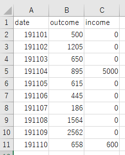

# 準備
## Rについて

R言語は統計解析やグラフ描画に特化したオープンソースの言語です. オープンソースなので将来どこへ行っても使うことができます. オープンソースなのでネットに情報が溢れています. オープンソース最高！また,文法が他の言語よりも簡単でプログラミングを全くやったことのない人でも始めやすい言語です. 当研究室では情報量の大きい実験データの定量的,統計的解析が求められることが多いのでRを使えると研究が飛躍的にはかどります. それではまずはRとその統合開発環境であるRstudioのインストールからはじめましょう.

## Rのインストール
以下のURLを踏んでください.  
Windows: https://cran.ism.ac.jp/bin/windows/  
Mac: https://cran.ism.ac.jp/bin/macosx/

以下Windows版をインストールしたきのスクリーンショットを表示します.  
  


"install R for the first time" をクリック.  


"Download R XXX for Windows" をクリックしてインストーラーをダウンロードして実行する.  
"次へ"を押して行ってください.


この画面のときにOSが32 bitか64 bitかを確認して自分のOS出ない方のチェックを外してください. (自分のOSが64 bitなら"32-bit files" のチェックを外す.)  

最後まで行けばRのインストールは完了です.  

次にRstudioのインストールを行います.

## Rstudioのインストール

以下のURLを踏んでください.  
https://rstudio.com/products/rstudio/download/  

一番左の"RStudio Desktop"のFree版の"DOWNROAD"をクリック.  


"DOWNROAD RSTUDIO FOR WINDOWS"をクリック.インストーラーをダウンロードして実行. 途中デスクトップにアイコンを作成するか聞かれるのでチェックを入れてください.（忘れてしまった場合は Rstudio/bin/rstudio.exeが実行ファイルなのでこれのショートカットをデスクトップなり好きなところに作っておくと便利.）  
では,いよいよRを動かしてみましょう.  
  
# 実際に動かそう！

## Rstudioの起動
Rstudioを起動したらctrl + shift + Nを押してください.すると以下のような画面になるはずです.  


1. エディタ. ここにスクリプトを打ちます.
2. 環境の表示. ここには定義した変数名とその値がまとめられます.
3. プロット. 描画した図はここに表示されます.
4. コンソール. エラーや警告はここに表示されます.  

白い画面は長時間作業をしていると目が疲れてくるので暗いテーマに変更することをおすすめします. 左上のtools→Global Options→Appearance→Editor themeで好きなテーマを選べます.

## 簡単な計算

それではまず簡単な計算から. 左上のエディタに以下のような計算を打ち込んで全選択してctrl + Enterを押して実行してください.
```R
1 + 3 #summation
4 - 2 #subtraction
7/2 #division
8*9 #multiplication
2**4 #power
12%5 #mod
```
#より後ろに書いた文字はコメントとして無視されます. 実行するとコンソールに以下のように結果が表示されます.  
```R
> 1 + 3 #summation
[1] 4
> 4 - 2 #subtraction
[1] 2
> 7/2 #division
[1] 3.5
> 8*9 #multiplication
[1] 72
> 2**4 #power
[1] 16
> 12%%5 #mod
[1] 2
```
[1]というのは今はあまり気にしなくても大丈夫です.

## コードの保存
ctrl + S か　file→Save Asで保存できます.

# 変数
  
次は変数を使った計算をしてみましょう. 変数とはデータ（値）を格納しておく箱のことです. 以下のコードをエディタに打ち込んで全選択→ctrl + Enterで実行してください.
```R
x <- 8
y <- 2
x + y

実行結果
> x <- 8
> y <- 2
> x + y
[1] 10
```
このコードでは変数x, yにそれぞれ8, 2を代入してからxとyを足し合わせています. Rでは変数に値を格納する（代入と言います.）ときは"<-"または"="を使います. "<-"の方が好まれる傾向があります. 変数は以下のように上書きすることができます. 逆に間違えて同じ変数名を使ってしまって, 望まない上書きがされることのないよう気をつけましょう.
```R
x <- 8
y <- 2
x + y

x <- -8
x + y

実行結果
> x <- 8
> y <- 2
> x + y
[1] 10
> 
> x <- -8
> x + y
[1] -6
```
さて今右上の環境の表示を確認すると以下のように変数名と各変数に格納されている値が表示されています.  


  
もっと複雑な処理を行うようになってきて途中でわからなくなったらここの情報を見直すと良いでしょう.  

# データ構造
データ構造とはデータを保持する形式のことです. Rのデータ構造で非常によく使うものについて説明します.  
  
## ベクトル  

- ベクトルは複数の値のインデックス（順番）付きの集合です. 以下の例を見てください.

```R
vec1 <- c(1,2,3,4)
vec2 <- c(5,5,5,5)

vec1 + vec2 #summation
vec2 - vec1 #subtraction
vec2/vec1 #division
vec1*vec2 #multiplication
vec2**vec1 #power
vec2%%vec1 #mod

実行結果
> vec1 <- c(1,2,3,4)
> vec2 <- c(5,5,5,5)
> 
> vec1 + vec2 #summation
[1] 6 7 8 9
> vec2 - vec1 #subtraction
[1] 4 3 2 1
> vec2/vec1 #division
[1] 5.000000 2.500000 1.666667 1.250000
> vec1*vec2 #multiplication
[1]  5 10 15 20
> vec2**vec1 #power
[1]   5  25 125 625
> vec2%%vec1 #mod
[1] 0 1 2 1
```
Rではベクトルを`c()`で書き表します. 数値演算はいわゆる高校のベクトルで習ったルールで上のように行われます.  
- ベクトルとスカラーの計算も直感に反することはありません. 以下の例を見てください.
```R
vec1 <- c(1,2,6,5,8)

vec1 + 5 #summation
vec1 - 5 #subtraction
vec1/3 #division
vec1*3 #multiplication
vec1**2 #power
vec1%%3 #mod

実行結果
> vec1 <- c(1,2,6,5,8)
> 
> vec1 + 5 #summation
[1]  6  7 11 10 13
> vec1 - 5 #subtraction
[1] -4 -3  1  0  3
> vec1/3 #division
[1] 0.3333333 0.6666667 2.0000000 1.6666667 2.6666667
> vec1*3 #multiplication
[1]  3  6 18 15 24
> vec1**2 #power
[1]  1  4 36 25 64
> vec1%%3 #mod
[1] 1 2 0 2 2
```

- ベクトルの要素数は`length()`関数で取得します. 関数については後ほど詳しく述べます.  

```R
vec1 <- c(1,2,6,5,8)
length(vec1)

実行結果
> vec1 <- c(1,2,6,5,8)
> length(vec1)
[1] 5
```

- n番目の要素を取り出したい場合は`[n]`といった記法を使用します. 以下の例を見てください. 

```R
vec1 <- c("c-Fos", "c-Myc", "NFKBIA", "TNFAIP3", "JUN", "JUNB")
vec1[3]

vec2 <- c(4,2,6,8,7,1,6,6,5)
vec2[1]
vec2[4]
vec2[1] + vec2[4]

実行結果
> vec1 <- c("c-Fos", "c-Myc", "NFKBIA", "TNFAIP3", "JUN", "JUNB")
> vec1[3]
[1] "NFKBIA"
> 
> vec2 <- c(4,2,6,8,7,1,6,6,5)
> vec2[1]
[1] 4
> vec2[4]
[1] 8
> vec2[1] + vec2[4]
[1] 12
```
文字列を値として扱う場合は必ず`""`で囲います. これを忘れてしまうと変数としてみなされてエラーが出ます. 
  
- ベクトルから*n*番目の要素を削除したベクトルを作るときは以下のように書きます.  

```R
vec1 <- c("c-Fos", "c-Myc", "NFKBIA", "TNFAIP3", "JUN", "JUNB")
vec1
n <- 3
vec2 <- vec1[-n] #Delete n th element
vec2

実行結果
> vec1 <- c("c-Fos", "c-Myc", "NFKBIA", "TNFAIP3", "JUN", "JUNB")
> vec1
[1] "c-Fos"   "c-Myc"   "NFKBIA"  "TNFAIP3" "JUN"     "JUNB"
> n <- 3
> vec2 <- vec1[-n] #Delete n th element
> vec2
[1] "c-Fos"   "c-Myc"   "TNFAIP3" "JUN"     "JUNB"  
```

- 連続した整数値のベクトルを作りたいときは`x:y`のように書きます.

```R
vec <- 1:10
vec

実行結果
> vec <- 1:10
> vec
 [1]  1  2  3  4  5  6  7  8  9 10
```

- 初項*x*, 末項*y*, 公差*d*の等差数列をベクトルにしたい場合は`seq()`関数を使って以下のように書きます. 

```R
x <- 0
y <- 10
d <- 2

seq(x,y,d)

実行結果
> x <- 0
> y <- 10
> d <- 2
> 
> seq(x,y,d)
[1]  0  2  4  6  8 10
```

- ２つのベクトルをつなげるには以下のように書きます.  

```R
vec1 <- c("c-Fos", "c-Myc", "NFKBIA")
vec2 <- c("TNFAIP3", "JUN", "JUNB")
vec3 <- c(vec1,vec2)
vec3

実行結果
> vec1 <- c("c-Fos", "c-Myc", "NFKBIA")
> vec2 <- c("TNFAIP3", "JUN", "JUNB")
> vec3 <- c(vec1,vec2)
> vec3
[1] "c-Fos"   "c-Myc"   "NFKBIA"  "TNFAIP3" "JUN"     "JUNB"
```

- ベクトル`vec`を*n*回繰り返したベクトル`multi_vec`を作りたい場合は`rep()`関数を使って以下のように書きます.

```R
vec <- c("Sun", "Mon", "Tue", "Wed", "Thu", "Fri", "Sat")
n <- 3

multi_vec <- rep(vec,3)
multi_vec

実行結果
> vec <- c("Sun", "Mon", "Tue", "Wed", "Thu", "Fri", "Sat")
> n <- 3
> 
> multi_vec <- rep(vec,3)
> multi_vec
 [1] "Sun" "Mon" "Tue" "Wed" "Thu" "Fri" "Sat" "Sun" "Mon" "Tue" "Wed" "Thu" "Fri" "Sat" "Sun" "Mon" "Tue"
[18] "Wed" "Thu" "Fri" "Sat"
```
[1]というのはその行の一番左の要素が1番目で[18]というのはその行の一番左に要素が18番目であることを示します.  
  
- ベクトルの中にある特定の要素が何番目にあるかを取得するには例えば`which()`関数を使用します.

```R
vec1 <- c("c-Fos", "c-Myc", "NFKBIA", "TNFAIP3", "JUN", "JUNB")
which(vec1 == "TNFAIP3")

vec2 <- c(4,5,6,4)
which(vec2 == 4)

実行結果
> vec1 <- c("c-Fos", "c-Myc", "NFKBIA", "TNFAIP3", "JUN", "JUNB")
> which(vec1 == "TNFAIP3")
[1] 4
> 
> vec2 <- c(4,5,6,4)
> which(vec2 == 4)
[1] 1 4
```
上の例では`vec1`の中の`"TNFAIP3"`のインデックス（何番目か）と`vec2`の中の4のインデックスを出力しています. `==`は論理演算子と呼ばれるものでこの場合は「等しい」という意味です. 論理演算子についても後ほど詳しく述べます.  
  
## データフレーム
次にデータフレームというデータ構造について説明します. データフレームとは以下のような見た目のデータ構造です.  
  
つまり表です. このデータはRに予め用意されているサンプルである`iris`というデータです. これはあやめのがく片(Sepal)と花びら(Petal)それぞれの長さと幅の品種(Species)ごとのデータです. 全部で150個の花について調べています. まずはirisを変数`df`に格納しましょう.  
```R
df <- iris
```

- データフレームの行数を取得するには`nrow()`関数を, 列数を取得するには`ncol()`関数を取得します.  

```R
nrow(df)
ncol(df)

実行結果
> nrow(df)
[1] 150
> ncol(df)
[1] 5
```

- データフレームは`$`を使って列をベクトルとして取り出すことができます. 以下の例では`df`の`Sepal.Length列をベクトルとして取り出しています.  

```R
vec <- df$Sepal.Length
```

- データフレームをベクトルから自作するには以下のように`data.frame()`関数を使います.

```R
gene <- c("NFKBIA", "NFKBIZ", "TNFAIP3", "JUN", "ATF3")
expression <- c(10.5, 5.2, 20.0, 15.8, 2.9)

my_df <- data.frame(GENE = gene, EXPRESSION = expression)
```

これを実行すると環境に`my_df`が追加されるのでクリックして見てみると以下のように表示されるはずです.  
  

## 練習問題

1. 1~100までの整数それぞれの2乗の値を出力してください.
1. `iris`の`Petal.Width`列をベクトルとして取り出し, 10番目の要素を削除してください.
1. `iris`の`Petal.Length`が1.4である行数を出力してください.


# 関数

数学での「関数」の定義をおさらいしましょう. 「関数」とは入力が与えられたときに一意に結果を返すものです. 身近な例として自動販売機が関数と言えます. 飲み物の自動販売機でお金を入れてボタンを押すと必ずそのボタン上に置かれている飲み物と同じ飲み物が落ちてきます. 同じボタンを2回おして一回目はコーラが出てきて二回目は青汁が出てくるなんてことはありえません. もしそんなことが起きたなら自動販売機の故障なのですみやかに管理会社に連絡しましょう.  
プログラミングにおける関数も同じです. ある入力（引数（ひきすう）と言います.）が与えられたときに定義された計算を行って結果を返してくれます. また, 関数はほとんどのプログラミング言語で`function(引数)`の形をしています.  
Rには様々な便利な計算を行ってくれる関数が用意されています. ここではその中でも特に統計解析に欠かせない関数を紹介します.  

## ベクトルに関する関数

- `sum()`  
ベクトルを引数にとってその総和を返します.

```R
vec1 <- c(1,2,6,5,8)
sum(vec1)

実行結果
> vec1 <- c(1,2,6,5,8)
> sum(vec1)
[1] 22
```

- `mean()`  
ベクトルを引数にとってその平均を返します.  

```R
vec1 <- c(1.2, 1.3, 1.0, 1.5, 1.2, 1.4, 1.3, 1.0, 0.9)
mean(vec1)

実行結果
> vec1 <- c(1.2, 1.3, 1.0, 1.5, 1.2, 1.4, 1.3, 1.0, 0.9)
> mean(vec1)
[1] 1.2
```

- `sd()`  
ベクトルを引数にとってその標準偏差を返します.

```R
vec1 <- c(1.2, 1.3, 1.0, 1.5, 1.2, 1.4, 1.3, 1.0, 0.9)
sd(vec1)

実行結果
> vec1 <- c(1.2, 1.3, 1.0, 1.5, 1.2, 1.4, 1.3, 1.0, 0.9)
> sd(vec1)
[1] 0.2
```

- `median()`  
ベクトルを引数にとってその中央値を返します.

```R
vec1 <- c(1.1, 1.3, 1.0, 1.5, 1.0, 1.4, 1.3, 1.0, 0.9)
median(vec1)

実行結果
> vec1 <- c(1.1, 1.3, 1.0, 1.5, 1.0, 1.4, 1.3, 1.0, 0.9)
> median(vec1)
[1] 1.1
```

- `max()`, `min()`  
ベクトルを引数にとってそれぞれその最大値と最小値を返します.

```R
vec1 <- c(1.1, 1.3, 1.0, 1.5, 1.0, 1.4, 1.3, 1.0, 0.9)

max(vec1)
min(vec1)

実行結果
> vec1 <- c(1.1, 1.3, 1.0, 1.5, 1.0, 1.4, 1.3, 1.0, 0.9)
> 
> max(vec1)
[1] 1.5
> min(vec1)
[1] 0.9
```

- `which.max()`, `which.min()`  
ベクトルを引数にとってそれぞれその最大値と最小値のインデックスを返します.

```R
vec1 <- c(1.1, 1.3, 1.0, 1.5, 1.0, 1.4, 1.3, 1.0, 0.9)

which.max(vec1)
which.min(vec1)

実行結果
> vec1 <- c(1.1, 1.3, 1.0, 1.5, 1.0, 1.4, 1.3, 1.0, 0.9)
> 
> which.max(vec1)
[1] 4
> which.min(vec1)
[1] 9
```

- `sort()`  
ベクトルを引数にとってそれを昇順, 降順に並べ替えます.

```R
vec <- c(5, 1, 4, 2, 3)

sort(vec) #Ascending order
sort(vec, decreasing=TRUE) #Descending order

実行結果
> vec <- c(5, 1, 4, 2, 3)
> 
> sort(vec) #Ascending order
[1] 1 2 3 4 5
> sort(vec, decreasing=TRUE) #Descending order
[1] 5 4 3 2 1
```

## データフレームに関する関数
ここではサンプルデータとして以下のようなデータフレーム`res`を用います.  
```R
gene1 <- c(12.2, 10.5, 8.24, 15.2, 7.23)
gene2 <- c(2.14, 5.20, 3.62, 4.88, 2.69)
gene3 <- c(32.2, 24.8, 42.2, 32.0, 20.0)

res <- data.frame(NFKBIA = gene1, MYC = gene2, CRK = gene3)
```

  

- `colnames()`  
データフレームを引数にとってその列名をベクトルで返す.  

```R
colnames(res)

実行結果
> colnames(res)
[1] "NFKBIA" "MYC"    "CRK"
```

これを用いて列名の変更も可能である.

```R
colnames(res) <- c("Nfkbia", "Myc", "Crk")
colnames(res)

実行結果
> colnames(res) <- c("Nfkbia", "Myc", "Crk")
> colnames(res)
[1] "Nfkbia" "Myc"    "Crk"
```

- `colMeans()`  
データフレームを引数にとってその各列の平均値をベクトルで返す.  

 ```R
colMeans(res)

実行結果
> colMeans(res)
NFKBIA    MYC    CRK
10.674  3.706 30.240
```

データフレームを引数にとってその各行の平均値をベクトルで返す`rowMeans()`もあります.  

## 練習問題

1. `iris`の`Sepal.Length`行の平均値, 標準偏差, 最大値, 最小値を求めてください.
1. `iris`の列名を一列目から順に`Gaku_no_Nagasa`, `Gaku_no_Haba`, `Hanabira_no_Nagasa`, `Hanabira_no_Haba`, `Syurui`に変更してください.

# 論理式
論理式とはある命題が正しいかどうかを判定する式です. Rでは命題が正しい場合は`TRUE`と表示され正しくない場合は`FALSE`と表示されます. 

## 比較演算子
Rでは比較演算子を以下のように記述します.  

|記号|意味|
|:--:|:--:|
|==|等しい|
|< |小なり|
|>|大なり|
|<=|小なりイコール|
|>=|大なりイコール|  

```R
> a <- 4
> b <- 5
> 
> a == b - 1
[1] TRUE
> 
> b >= a
[1] TRUE
> 
> b < a
[1] FALSE
```

## 論理演算子
Rでは論理演算子を以下のように記述します.

|記号|意味|
|:--:|:--:|
|!|否定|
|&|且つ|
|\||または|

```R
> a <- 4
> b <- 5
> c <- 2
> 
> a != b #a is not equal to b.
[1] TRUE
> 
> a == b & b == b #a is equal to b and b is equal to b.
[1] FALSE
> 
> a != b | a == c #a is not equal to b or a is equal to c.
[1] TRUE
```
  
# 条件分岐
ここでは条件によって異なる処理を行う方法について説明します. 例として偶数を与えると`even`と出力し, 奇数が与えられると`odd`と出力するプログラムを書いてみましょう.  
偶奇判定をするためには与えられた整数を2で割った余りを確認すれば良いです. 余りが0なら偶数で, 1なら奇数となります. これをRで実装してみましょう.  
  
多くのプログラミング言語ではこのような条件分岐の処理はif文と呼ばれる文法を使用します. Rでは以下のように記述します.  
```R
a <- 4 #Even number

if(a%%2 == 0){
  print("even")
}else{
  print("odd")
}

実行結果
> a <- 4 #Even number
> 
> if(a%%2 == 0){
+   print("even")
+ }else{
+   print("odd")
+ }
[1] "even"
```
`if`の後ろに書いた`()`の中の論理式が`TRUE`であるときに`{}`の中に書いた処理が実行されます. また, `if`の論理式が`TRUE`でない場合は`else{}`を書いておけばその中の処理が実行されます.
```R
a <- 3 #Odd number

if(a%%2 == 0){
  print("even")
}else{
  print("odd")
}

実行結果
> a <- 3 #Odd number
> 
> if(a%%2 == 0){
+   print("even")
+ }else{
+   print("odd")
+ }
[1] "odd"
```

以下のようにして3つ以上の条件について処理を行うことも可能です.  
```R
a <- 5 #mod 3 = 2

if(a%%3 == 0){
  print("patern A")
}else if(a%%3 == 1){
  print("patern B")
}else{
  print("patern C")
}

実行結果
> a <- 5 #mod 3 = 2
> 
> if(a%%3 == 0){
+   print("patern A")
+ }else if(a%%3 == 1){
+   print("patern B")
+ }else{
+   print("patern C")
+ }
[1] "patern C"
```

## 練習問題
1. 5の剰余類について上と同じような処理を書いてください.  

# 繰りかえし文
同じ処理を複数回行いたいときはfor文を使用します. 具体例としてベクトルの中の値を1番目から順番に出力するプログラムを書いてみましょう. 

```R
vec <- c("Python", "R", "Julia", "cpp", "Ruby")

for(i in 1:length(vec)){
  print(vec[i])
}

実行結果
> vec <- c("Python", "R", "Julia", "cpp", "Ruby")
> 
> for(i in 1:length(vec)){
+   print(vec[i])
+ }
[1] "Python"
[1] "R"
[1] "Julia"
[1] "cpp"
[1] "Ruby"
```

まず, `for(i in ベクトル)`というように書きます. このように書くと最初にベクトルの1番目の値が`i`に代入されて`{}`の中の処理が行われます. すべての処理が終わると今度はベクトルの2番目の値が`i`に代入されて`{}`の中の処理が行われれます. 上の例では1から`vec`の長さである5までの整数が順に`i`に代入されていきます.  
さらにいくつか例をあげます.  
  
整数が格納されたベクトルのそれぞれが5より大きいかどうかを順に出力する. 
```R
vec <- c(1,6,8,2,7)

for(i in 1:length(vec)){
  vec[i] > 5
}

実行結果
> vec <- c(1,6,8,2,7)
> 
> for(i in 1:length(vec)){
+   print(vec[i] > 5)
+ }
[1] FALSE
[1] TRUE
[1] TRUE
[1] FALSE
[1] TRUE
```
  
1~30までの整数のうち3の倍数のみを出力する.  
```R
for(i in 1:30){
  if(i%%3 == 0){
    print(i)
  }
}

実行結果
> for(i in 1:30){
+   if(i%%3 == 0){
+     print(i)
+   }
+ }
[1] 3
[1] 6
[1] 9
[1] 12
[1] 15
[1] 18
[1] 21
[1] 24
[1] 27
[1] 30
```

また, 回数の制限なしにある論理式が`FALSE`になるまで同じ処理を繰り返すwhile文というものもあります.

```R
a <- 0
while(a <= 5){
  print("Adding")
  a = a + 1
}

> a <- 0
> while(a <= 5){
+   print("Adding")
+   a <- a + 1
+ }
[1] "Adding"
[1] "Adding"
[1] "Adding"
[1] "Adding"
[1] "Adding"
[1] "Adding"
```
`while(論理式)`というように書きます. 上の例では`a <= 5`という論理式が`TRUE`である間は`"Adding"`と出力し続けるという処理です. 一回の処理で`a`は1ずつ大きくなり, `a`は最初0なので6回処理を行うとa = 6となり`a <= 5`が`FALSE`となるので処理が止まります.  
  
ここでもさらにいくつかの例を示します.  
`enemy_HP`が0以下になるまで`"Attack!"`と出力してループを抜けたら`"Win!"`と出力する.
```R
enemy_HP <- 50
while(enemy_HP > 0){
  print("Attack!")
  enemy_HP <- enemy_HP - 10
}
print("Win!")

実行結果
> enemy_HP <- 50
> while(enemy_HP > 0){
+   print("Attack!")
+   enemy_HP <- enemy_HP - 10
+ }
[1] "Attack!"
[1] "Attack!"
[1] "Attack!"
[1] "Attack!"
[1] "Attack!"
> print("Win!")
[1] "Win!"
```

`vec`の中の値を1番目から`"A"`であるかどうかを調べていき, `"A"`である値のインデックスを出力する.  
```R
vec <- c("T", "G" , "C", "A", "C")
i <- 1
while(vec[i] != "A"){
  i <- i+1
}
print(i)

> vec <- c("T", "G" , "C", "A", "C")
> i <- 1
> while(vec[i] != "A"){
+   i <- i+1
+ }
> print(i)
[1] 4
```

## 練習問題

1. 23~58の整数の中で7の倍数を出力してください.  

# 自作関数
自分の行いたい処理がRの用意されている関数の中にない場合があります. そのようなときは自分で関数を自作する必要があります. 以下に与えられた整数が偶数であるときは`"Even"`を, 奇数であるときは`"Odd"`と出力する関数を作る例をあげます.

```R
even_odd <- function(x){
  if(x%%2  == 0){
    print("Even")
  }else{
    print("Odd")
  }
}

even_odd(4)
even_odd(5)

実行結果
> even_odd <- function(x){
+   if(x%%2  == 0){
+     print("Even")
+   }else{
+     print("Odd")
+   }
+ }
> 
> even_odd(4)
[1] "Even"
> even_odd(5)
[1] "Odd"
```

まず, `関数名 <- function(引数)`というように書きます. つぎに`{}`の中にその引数について行いたい処理を書きます. また, 関数になにか値を返させたいときは`return()`を使います. 以下に例を示します.  
  
与えられた整数が3の倍数のときは1を, そうでないときは0を返す関数.
```R
my_func <- function(x){
  if(x%%3 == 0){
    return(1)
  }else{
    return(0)
  }
}

4 + my_func(6)
4 + my_func(5)

実行結果
> my_func <- function(x){
+   if(x%%3 == 0){
+     return(1)
+   }else{
+     return(0)
+   }
+ }
> 
> 4 + my_func(6)
[1] 5
> 4 + my_func(5)
[1] 4
```

## 練習問題

1. 与えれた数値ベクトルの最大値と最小値の和を返す関数を作成してください.  

2. 与えられた数値ベクトルの各要素が1番目の要素に対して何倍かをベクトルで返す関数を作成してください. つまり, 例えば`c(5,10,12,4)`が与えられたときには`c(1,2,2.4,0.8)`を返す関数を作成してください.  

# ggplot2によるグラフの描画  

最後にRのパッケージであるggplot2によるグラフの描画を行います. まずはggplot2のインストールを行うのでコンソールに以下のように打ち込んで実行してください.  

```R
install.packages("ggplot2")
```

これで完了です. また, この操作は一回行えば以降はずっとggplot2を使うことができます.   
それではさっそくグラフを描いていきます. 先程のサンプルデータ`iris`を使用します. 以下の例を見てください.

```R
library(ggplot2)

df <- iris

g <- ggplot(df, aes(x = Sepal.Length, y = Sepal.Width, color = Species))+
  geom_point()

plot(g)
```

これを実行すると右下に以下のような図が表示されます.  

 

ggplotでは変数（上の例では`g`）にグラフオブジェクトを格納してその変数を`plot()`関数に渡すことで図をプロットする事ができます.  

グラフオブジェクトで最も大切な部分は`ggplot()`の引数です. `ggplot()`の引数では

1. どのデータを使用するか.

2. x軸, y軸にどの行の数値をプロットするか.

3. 色分けはどの行の値を基準に行うか.  

を指定します. 2.と3.は`aes()`の中に記述します. 上の例では

1. データとして`df`を使用する.

2. x軸に`Sepal.Length`を, y軸に`Sepal.Width`を取る.

3. `Species`の値が同じものを同じ色でプロットする.  

としています. 次にどのようなプロットを行うかをしていするのがその次の`geom_point()`の部分になります. ggplotのは様々な`geom_XXX()`という関数が用意されていて目的に応じて様々なプロットを行うことができます. 以下に代表的なものを紹介します.

|関数名|グラフ|
|:--:|:--:|
|geom_point()|散布図|
|geom_line()|折れ線グラフ|
|geom_bar()|棒グラフ|
|geom_hisgram()|ヒストグラム|
|geom_boxplot()|箱ひげ図|
|geom_violin()|バイオリンプロット|  

次に`Species`ごとの`Sepal.Width`の分布を示す箱ひげ図を描いてみましょう.  

```R
g <- ggplot(df, aes(x = Species, y = Sepal.Width))+
  geom_boxplot()

plot(g)
```

 

バイオリンプロットに変えてみます. 

```R
g <- ggplot(df, aes(x = Species, y = Sepal.Width))+
  geom_violin() #geom_boxplot() -> geom_violin()

plot(g)
```

 

種ごとに色を変えたい場合は以下のようにすればよいです.  

```R
g <- ggplot(df, aes(x = Species, y = Sepal.Width, fill = Species))+ #color = Speciesをaes()に追加
  geom_violin()+
  guide(fill = F) #これがないと右に不必要な凡例が出てしまいます.

plot(g)
```
 

最後に文字の大きさや軸ラベルの設定を行う例を紹介します.  

```R
g <- ggplot(df, aes(x = Species, y = Sepal.Width, fill = Species))+ #color = Speciesをaes()に追加
  geom_violin()+
  guide(fill = F)+ #これがないと右に不必要な凡例が出てしまいます.
  ylab("GakunoHaba")+ #y軸のラベルを"GakunoHaba"に変更.
  xlab("Syurui")+ #x軸のラベルを"Syurui"に変更.
  theme(axis.title.y = element_text(size = 25))+ #y軸のラベルの文字の大きさを変更.
  theme(axis.title.x = element_text(size = 25))+ #x軸のラベルの文字の大きさを変更.
  theme(axis.text.y = element_text(size = 20))+ #y軸の目盛りの文字の大きさを変更.
  theme(axis.text.x = element_text(size = 20)) #x軸の目盛りの文字の大きさを変更.

plot(g)
```
 

## 練習問題
`Species`ごとの`Sepal.Length`の分布をしめすヒストグラムを描いてください. ヒント: `Species`ごとに分けてグラフを描くためには`facet_wrap(~Species)`をグラフオブジェクトに足してください.

## グラフの保存

グラフの保存は以下のように行います.  
```R
ggsave(plot = g, file = "graph.png", w = 6.2, w = 4.8, dpi = 600)
```

`plot`には保存するグラフオブジェクトを, `file`には保存するファイルの名前を, `w`には横幅を, `h`には縦幅を, `dpi`には解像度を指定します. （`dpi`はPDFで保存する場合は必要ありません.）また, `file`にファイル名のみを指定した場合はワーキングディレクトリに保存されます. ワーキングディレクトリについては次で説明します.  

## ワーキングディレクトリ
ワーキングディレクトリとは作業を行うディレクトリのことで現在位置のことだと思ってください. Rがファイルの読み書きをするとき, 相対パスや絶対パスによる指定がない限りワーキングディレクトリ内のファイルで指定されたファイル名と同じ名前のファイルを探して読み, ワーキングディレクトリにファイルを保存します. ワーキングディレクトリは以下のようにして設定できます.  
```R
setwd("Path to working directory")
```
## ファイルの読み込み
テキストファイルやcsv ファイルなどを読み込んでデータフレーム等にして扱うことができます. 様々なファイル読み込みのための関数がありますがここでは代表的なものとして`read.csv()`を紹介します.  

例として下のようなcsv ファイルを用意しました.  

 

このファイルは以下のようにして読み込むことができます.  

```R
df <- read.csv("Book2.csv",stringsAsFactors = F)
```

 


